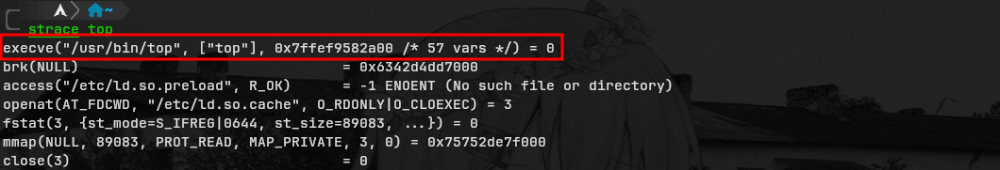
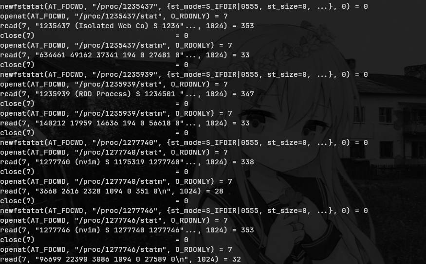

## Introduction

If you have reading access to a Linux system (example: xxe, path traversal) it
is possible to enumerate a lot of information, processes, users, arp tables,
devices, etc.

## Linux Directory Structure

Below there is a short summary of the use of each directory, you can use directories
randomly, this is just a very simple abstraction to understand the context, it is
a basic overview of the directories.

> [!NOTE]
> In linux everthing is a file

| directories | Description                      |
| ----------- | -------------------------------- |
| /bin        | User binaries                    |
| /system     | Configuration                    |
| /home       | Home directory                   |
| /opt        | Optional or third-party software |
| /tmp        | Temporary space                  |
| /usr        | User binaries and program data   |
| /var        | Variable data                    |
| /dev        | Devices                          |
| /etc        | Configuration                    |
| /lib        | Shared libraries                 |
| /sbin       | System binaries                  |
| /boot       | Boot files                       |
| /proc       | Process and kernel files         |
| /media      | Mount point for removable media  |
| /mnt        | Mount directory                  |
| /srv        | Service data                     |

## [ENUM] Proc filesystem

### What is it?

The `proc` filesystem is a pseudo-filesystem,it provides an interface to internal
data structures about running processes in the kernel, by the way this directory
contains information about running processes and files used by kernel in real
time. You can obtain more informations using `man`

Some programns use the `/proc` for make this vizualiation (data) more user-friendly,
like the `top`, you can use `strace` for view system calls and signals of a "program"





### Enumeration using **/proc**

**/proc/net/arp -** This file contains de **ARP Cache**, it can be used to enumerate
machines on LAN

```txt
IP address       HW type     Flags       HW address            Mask     Device
192.168.0.107    0x1         0x2         7c:c2:c6:32:aa:dc     *        ens33
192.168.0.1      0x1         0x2         c8:3a:35:7e:d4:c0     *        ens3
```

**/proc/net/dev -** It contains basic information about network device, it is used
by ifconfig and it can be used for enumerate network interfaces

```txt
Interface     |   Receive                                                 |  Transmit
              |bytes    packets errs drop fifo frame compressed multicast |bytes    packets errs drop fifo colls carrier compressed
    lo:       54554314    7601    0    0    0     0          0         0   54554314    7601    0    0    0     0       0          0
 ens33:       21674754   29447    0    0    0     0          0         0    4373523   22413    0    0    0     0       0          0
docker0:      0              0    0    0    0     0          0         0          0       0    0    0    0     0       0          0
br-d2e5:      947568      1258    0    0    0     0          0         0    2397564    1428    0    0    0     0       0          0
```
